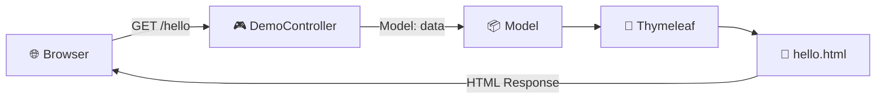

<div align="center">


# 🌱 Spring Boot Web Programming (2)

**성결대학교 미디어소프트웨어학과 · Spring Boot 3주차 학습 프로젝트**

Spring Boot + MVC + Thymeleaf를 기반으로  
웹 요청을 Controller에서 처리하고 HTML 화면으로 응답하는 기본 구조를 학습하기 위한 프로젝트입니다.

<p>
  
  
  
  
  
</p>

</div>

---

## 📌 목차

<details open>
<summary><b>바로가기</b></summary>

- [1. 프로젝트 소개](#1-프로젝트-소개)
- [2. 개발 환경](#2-개발-환경)
- [3. 주요 기능](#3-주요-기능)
- [4. 파일 명세](#5-파일-명세)
- [6. 동작 흐름](#6-동작-흐름)
- [7. 주요 코드](#8-주요-코드)
- [8. 화면 구성](#9-화면-구성)
- [9. 의존성 명세](#10-의존성-명세)
- [10. 학습 포인트](#11-학습-포인트)
- [11. 향후 확장](#12-향후-확장)

</details>

---

## 1. 프로젝트 소개

### 🎯 프로젝트 목적

이 프로젝트는 **웹프로그래밍(2)** 수업에서 Spring Boot의 기본적인 웹 애플리케이션 구조를 이해하기 위해 구성된 학습용 프로젝트입니다.

현재 구현된 핵심 흐름은 다음과 같습니다.

> **웹 브라우저 → HTTP GET 요청 → `DemoController` → Model 데이터 전달 → Thymeleaf `hello.html` → HTML 응답**

### 🧩 현재 구현 범위

| 구분 | 내용 |
|---|---|
| Framework | Spring Boot |
| Web | Spring Web MVC |
| View | Thymeleaf |
| Frontend | HTML + Bootstrap 5 + Bootstrap Icons |
| Build | Maven |
| Java | Java 25 |
| DB | MySQL Connector 의존성 포함 |
| 현재 DB 사용 | ❌ 별도 DB 연결 설정은 아직 없음 |
| 테스트 | Spring Boot Test 기본 클래스 포함 |

---

## 2. 개발 환경

### 💻 Required

- **JDK 25**
- **Maven Wrapper** (`mvnw`, `mvnw.cmd`)
- IntelliJ IDEA / VS Code 등 Java 개발 IDE
- 웹 브라우저

### 🛠️ Tech Stack

```text
Backend
└─ Spring Boot 4.1.1
   ├─ Spring Web MVC
   ├─ Thymeleaf
   ├─ Actuator
   └─ Spring Web Services

Frontend
├─ HTML5
├─ Bootstrap 5
├─ Bootstrap Icons
└─ JavaScript / jQuery

Build
└─ Maven

Database
└─ MySQL Connector/J
   └─ 현재 프로젝트에서는 의존성만 등록된 상태
```

---

## 3. 주요 기능

### 👋 Hello 페이지

`GET /hello` 요청을 처리하여 Thymeleaf 기반의 `hello.html`을 반환합니다.

Controller에서 Model에 데이터를 넣고:

```java
model.addAttribute("data", " 반갑습니다.");
```

Thymeleaf에서 해당 값을 HTML에 출력합니다.

```html
<p th:text=" '안녕하세요, ' + ${data} + '님!'"></p>
```

따라서 브라우저에서는 다음과 같은 형태의 결과가 출력됩니다.

```text
안녕하세요! 헬로우

안녕하세요, 반갑습니다.님!
```

> `data` 앞에 공백이 포함되어 있기 때문에 실제 화면에서는 약간의 공백이 나타날 수 있습니다.

---


---

## 4. 파일 명세

### ☕ Java

| 경로 | 파일 | 역할 |
|---|---|---|
| `src/main/java/com/example/demo/` | `DemoApplication.java` | Spring Boot 애플리케이션의 시작점 |
| `src/main/java/com/example/demo/` | `DemoController.java` | HTTP 요청을 처리하는 Controller |
| `src/test/java/com/example/demo/` | `DemoApplicationTests.java` | Spring Boot 애플리케이션 테스트 |

### 🌐 Template

| 경로 | 파일 | 역할 |
|---|---|---|
| `src/main/resources/templates/` | `hello.html` | `/hello` 요청에 대한 Thymeleaf 화면 |
| `src/main/resources/templates/` | `index.html` | 포트폴리오 형태의 HTML 템플릿 |
| `src/main/resources/templates/` | `index copy.html` | `index.html`의 복사본 |

> **주의:** 현재 Controller에는 `/`에 대한 `@GetMapping`이 없습니다. 따라서 `index.html`은 Thymeleaf 템플릿으로 존재하지만, 현재 Java Controller에서 직접 연결하는 코드는 확인되지 않습니다.

### 🎨 Static

`src/main/resources/static/`은 브라우저에서 사용하는 정적 리소스를 관리합니다.

```text
static/
├── css/       → Bootstrap 및 페이지 스타일
├── fonts/     → Bootstrap Icons 폰트
├── images/    → 프로필/프로젝트/클라이언트 이미지
└── js/        → Bootstrap, jQuery 및 페이지 동작 스크립트
```

Spring Boot에서는 일반적으로 다음과 같은 형태로 정적 리소스를 참조할 수 있습니다.

```html
<link rel="stylesheet" href="/css/bootstrap.min.css">
<script src="/js/bootstrap.min.js"></script>

```

---

## 5. 동작 흐름

### 🔄 MVC Request Flow



### 📌 실제 코드 기준 흐름

```text
1. 사용자가 /hello 접속
        ↓
2. DemoController의 @GetMapping("/hello") 실행
        ↓
3. Model에 "data" 속성 저장
        ↓
4. "hello" 문자열 반환
        ↓
5. templates/hello.html 탐색
        ↓
6. Thymeleaf가 ${data} 처리
        ↓
7. 완성된 HTML을 브라우저에 응답
```

## 8. 주요 코드

### 🚀 `DemoApplication.java`

Spring Boot 애플리케이션의 시작점입니다.

```java
@SpringBootApplication
public class DemoApplication {

    public static void main(String[] args) {
        SpringApplication.run(DemoApplication.class, args);
    }

}
```

`@SpringBootApplication`은 Spring Boot 애플리케이션임을 나타내며, 애플리케이션 실행에 필요한 자동 설정과 컴포넌트 탐색 등의 기능을 활성화합니다.

---

### 🎮 `DemoController.java`

현재 프로젝트의 핵심 웹 Controller입니다.

```java
@Controller
public class DemoController {

    @GetMapping("/hello")
    public String hello(Model model) {

        model.addAttribute("data", " 반갑습니다.");

        return "hello";
    }
}
```

#### 코드 역할

| 코드 | 의미 |
|---|---|
| `@Controller` | Spring MVC Controller 등록 |
| `@GetMapping("/hello")` | GET `/hello` 요청 처리 |
| `Model model` | View에 전달할 데이터 저장 |
| `addAttribute()` | `data`라는 이름으로 값 전달 |
| `return "hello"` | `hello.html` View 선택 |

---

### 🌿 `hello.html`

Thymeleaf를 이용하여 Controller에서 전달한 값을 화면에 출력합니다.

```html
<p th:text=" '안녕하세요, ' + ${data} + '님!'"></p>
```

여기서:

```text
${data}
   ↓
" 반갑습니다."
   ↓
Thymeleaf가 HTML에 값 삽입
```

---

## 8. 화면 구성

### 👋 Hello Page

현재 프로젝트에서 Controller와 연결되어 있는 대표 화면입니다.

```text
┌──────────────────────────────────────────┐
│              헬로페이지                    │
├──────────────────────────────────────────┤
│                                          │
│        안녕하세요! 헬로우                 │
│                                          │
│        홈페이지 메인                      │
│                                          │
│        안녕하세요, 반갑습니다.님!         │
│                                          │
└──────────────────────────────────────────┘
```

### 🖥️ Portfolio Template

`index.html`에는 Bootstrap 기반의 포트폴리오 형태 UI가 포함되어 있습니다.

주요 구성:

- 🏠 홈페이지
- 👤 소개
- 🛠️ 기술
- 💼 프로젝트
- 📞 연락처
- 🖼️ 프로필 및 프로젝트 이미지
- 🎨 Bootstrap / Bootstrap Icons
- ✨ JavaScript 기반 UI 효과

> 현재 `index.html`은 화면 템플릿으로 구성되어 있으며, Controller에서 `/` 경로와 연결하는 로직은 별도로 추가해야 합니다.

---

## 9. 의존성 명세

`pom.xml` 기준으로 확인되는 주요 의존성입니다.

| Dependency | 용도 | 현재 상태 |
|---|---|---|
| `spring-boot-starter-actuator` | 애플리케이션 모니터링/관리 | 등록됨 |
| `spring-boot-starter-thymeleaf` | Thymeleaf View 처리 | 사용 중 |
| `spring-boot-starter-webmvc` | Spring MVC 웹 기능 | 사용 중 |
| `spring-boot-starter-webservices` | Web Services 기능 | 등록됨 |
| `spring-boot-devtools` | 개발 편의 기능 | 개발 환경용 |
| `mysql-connector-j` | MySQL JDBC 연결 | 의존성 등록 |
| `lombok` | Java 코드 작성 편의 | 의존성 등록 |
| `spring-boot-starter-* -test` | 테스트 지원 | 테스트 scope |

### 🗄️ MySQL 관련 참고

현재 `mysql-connector-j`가 `pom.xml`에 등록되어 있지만, `application.properties`에는 데이터베이스 URL, 사용자 계정, 비밀번호 등의 설정이 없습니다.

현재 설정:

```properties
spring.application.name=demo
```

따라서 **현재 프로젝트를 MySQL 연동 프로젝트라고 단정하기보다는, 향후 DB 기능을 추가할 수 있도록 관련 의존성이 포함된 상태**로 보는 것이 정확합니다.

---

## 10. 학습 포인트

### 📚 이번 프로젝트에서 이해할 핵심 개념

#### ① Spring Boot Application

Spring Boot 프로젝트의 기본 실행 구조를 이해합니다.

```text
main()
  ↓
SpringApplication.run()
  ↓
Spring Boot Application 실행
```

#### ② Controller

사용자의 HTTP 요청을 Java 코드에서 처리합니다.

```text
GET /hello
      ↓
DemoController
```

#### ③ Model

Controller에서 View로 데이터를 전달합니다.

```text
Controller
    │
    │ addAttribute("data", ...)
    ↓
  Model
    │
    ↓
Thymeleaf
```

#### ④ Thymeleaf

Java에서 전달된 데이터를 HTML 템플릿에 동적으로 삽입합니다.

```html
${data}
```

#### ⑤ MVC 구조

```text
┌────────────┐
│    View    │  ← hello.html
└─────▲──────┘
      │
      │ Model
      │
┌─────┴──────┐
│ Controller │  ← DemoController
└─────▲──────┘
      │
      │ HTTP Request
      │
┌─────┴──────┐
│   Client   │  ← Browser
└────────────┘
```

---

## 11. 향후 확장

현재 프로젝트는 Spring Boot의 기본적인 MVC 흐름을 익히는 단계이므로 다음과 같이 확장할 수 있습니다.

### 🔹 1단계 — 메인 페이지 연결

```java
@GetMapping("/")
public String index() {
    return "index";
}
```

→ `index.html`을 `/` 주소와 연결

### 🔹 2단계 — 사용자 입력

```text
HTML Form
   ↓
POST Request
   ↓
Controller
   ↓
Model
   ↓
HTML
```

→ 이름, 게시글 등의 데이터를 입력받는 기능 구현

### 🔹 3단계 — 데이터베이스

```text
Controller
    ↓
Service
    ↓
Repository
    ↓
JPA
    ↓
MySQL
```

→ Spring Data JPA와 MySQL을 이용한 CRUD 구현

### 🔹 4단계 — 웹 서비스 형태로 발전

```text
👤 사용자
  ↓
🌐 Web UI
  ↓
🎮 Controller
  ↓
⚙️ Service
  ↓
🗃️ Repository
  ↓
🛢️ MySQL
```

---

## 📝 프로젝트 체크리스트

- [x] Spring Boot 프로젝트 생성
- [x] Spring MVC 의존성 확인
- [x] Controller 생성
- [x] `GET /hello` 구현
- [x] Model 데이터 전달
- [x] Thymeleaf View 연결
- [x] Bootstrap 기반 정적 리소스 구성
- [x] Maven Wrapper 구성
- [ ] `/` → `index.html` 연결
- [ ] Service 계층 추가
- [ ] Repository 계층 추가
- [ ] JPA 연동
- [ ] MySQL 데이터베이스 연동
- [ ] CRUD 기능 구현

---

## 👨‍💻 학습 기록

| 항목 | 내용 |
|---|---|
| 소속 | 성결대학교 |
| 전공 | 미디어소프트웨어학과 |
| 과목 | 웹프로그래밍(2) |
| 프로젝트 | Spring Boot 학습 프로젝트 |
| 핵심 학습 | Spring MVC · Controller · Model · Thymeleaf |
| 프로젝트 성격 | 수업 실습 / 학습용 |

---

<div align="center">

### 🌱 Learn → Build → Test → Improve

**Spring Boot로 웹 애플리케이션의 기본 구조부터 차근차근 학습합니다.**

</div>

## 4주차 실습 내용

- 데이터베이스 연동
- MySQL 로 DB 연결 및 데이터 생성

## 6주차 실습 내용

- Admin(관리자) 페이지 구현
- 권한 관리 기능 구현
- 관리자 보안 기능 구현